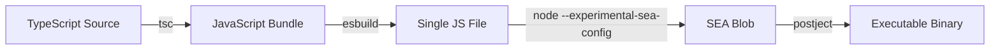

# TUI & Distribution Technical Outline

> **Goal**: Build a terminal user interface (TUI) for romdler with a "hackerish" aesthetic, and package it as a standalone binary (`romdler <cmd>`) for Linux and Windows.

---

## Table of Contents

- [1. Vision](#1-vision)
- [2. TUI Library Selection](#2-tui-library-selection)
- [3. Unknown Unknowns for Web Developers](#3-unknown-unknowns-for-web-developers)
- [4. Architecture](#4-architecture)
- [5. State Management](#5-state-management)
- [6. Theming & Colors](#6-theming--colors)
- [7. Navigation Patterns](#7-navigation-patterns)
- [8. Packaging & Distribution](#8-packaging--distribution)
- [9. Cross-Platform Considerations](#9-cross-platform-considerations)
- [10. Implementation Phases](#10-implementation-phases)
- [11. New Dependencies](#11-new-dependencies)
- [12. Resources](#12-resources)

---

## 1. Vision

### What We're Building

Cli executing download command in action:

```
   ______                    __ __
  |   __ \.-----.--------.--|  |  |.-----.----.
  |      <|  _  |        |  _  |  ||  -__|   _|
  |___|__||_____|__|__|__|_____|__||_____|__|
  Romdler v1.0.0

  ┌─Run─────────────────────────────────────────────────────────────────────────────────────────────────┐
  │  Command: [  Download       ▼ ]   Sytems: [  Game Boy       ▼ ]                          [  Send  ] │
  └─────────────────────────────────────────────────────────────────────────────────────────────────────┘
  ┌─Status─────────────────────┐  ┌───Browse────────────────────────────────────────────────────────────┐
  |                            |  │                Files (w)         |         Log (q)                  │
  │  Running: Download...      │  ├─────────────────────────────────────────────────────────────────────┤
  |  ────────────────────────  |  │  ↷ 2001 FIFA World Cup - Germany 2001.zip skipped                  █
  │  Found:.............1,304  │  │  ↷ 2003 FIFA World Cup - Germany 2003.zip skipped                  ░
  │  Filtered:..........324    │  │  ↷ 2006 FIFA World Cup - Germany 2006.zip skipped                  ░
  │  Downloaded:........422    │  │  ✔ 2K Sports - Major League Baseball 2K7 (USA) (Beta).zi...        ░
  │  Skipped:...........32     │  │  ✔ 2K Sports - Major League Baseball 2K7 (USA).zip 1.2mb           ░
  │  Failed:............1      │  │  ↷ ATV - Quad Power Racing (USA, Europe).zip skipped               ░
  │                            │  │  ↷ ATV - Thunder Ridge Riders (USA).zip skipped                    ░
  └────────────────────────────┘  │  ↷ Ace Combat Advance (USA, Europe).zip skipped                    ░
  ┌─Directory──────────────────┐  │  ✔ Activision Anthology (USA).zip 902kb                            ░
  │ downloads/                 █  │  ✔ Advance Guardian Heroes (USA).zip 430kb                         ░
  │  └─ Roms/                  ░  │  ✔ Ant (USA).zip 345kb                                             ░
  │    ├─ GB/                  ░  |  ✔ Airbender (USA).zip 656kb                                       ░
  │    ├─ GBC/                 ░  |  ✔ Airbender II (USA).zip 760kb                                    ░
  │    │ ├── deleted/          ░  ├─────────────────────────────────────────────────────────────────────┤
  │    │ └── Imgs/             ░  │   Downloading 2K Sports - Major League Baseball (US..               │
  │    └─ SNES/                ░  |   █████████████░░░░░░░| 67% | 1.2 MB/1.8 MB | 11.9 MB/s | 5/20      │
  └────────────────────────────┘  └─────────────────────────────────────────────────────────────────────┘

  ^c Quit   ^p Commands   ^q Log   ^w Files   f1 Help
```

Legend:

- Banner with dynamic version we set (pref from package.json)
- Run: Main execution section.
  - Command: is a dropdown selection list of current supported commands: e.g. Download, Dedupe, Purge, etc.
  - Systems:
    - These should be a drop down list of active systems set in the config, no actions - for information purposes to display connect systems with a green dot. Maybe it shows the folder it points to.
    - Send: Executes the commands select from command dropdown.
- Status:
  - Status of the current command running, if no command running "-". Updates real time when a command is running.
  - The item `Running: <cmd>`, three dots after should animate as if loading one by one. `.`, `..`, `...`
- Directory:
  - A list of directories only set by `downloadDir` in the config. Omits files. Folders should be selectable which will reflect in the Files (w) window.
  - When a `downloadDir` is set or incorrect, a notice should show "[ Set download dir in Config ]" or similar.
- Browse: Two tabs, both share a scrollable window. Full width, shared between buttons; centered. Selected tab is 'highlighted' with our primary color choosen
  - Log (q): Shortcut key (q) selects the Browse section and Log tab + window
  - Files: Files shown from the selected directory
    - Sortable by a top "table header": Title, Size, Date (Date Downloaded)
  - Downloading Section: this is fixed and doesn't change depending on what tab you choose inside `Browse` section.
    - When command is running that downloads show title (truncated when applicable), along with progress bar (third party package).
      - Any command that downloads should display there e.g.: download, scrape
- Footer command bar
  - Shows main commands that can be used inside the terminal when running cli

### Dual-Mode CLI

The TUI will complement (not replace) the existing CLI:

```bash
romdler                    # Launch interactive TUI
romdler download           # Direct command (existing behavior)
romdler download --dry-run # Flags work as before
```

---

## 2. TUI Library Selection

### Comparison

| Library                                                  | Approach     | Maintenance | TypeScript | Best For              |
| -------------------------------------------------------- | ------------ | ----------- | ---------- | --------------------- |
| **[Ink](https://github.com/vadimdemedes/ink)**           | React/JSX    | Active      | Native     | React developers      |
| [Blessed](https://github.com/chjj/blessed)               | Widget-based | Abandoned   | @types     | Low-level control     |
| [neo-blessed](https://github.com/embarklabs/neo-blessed) | Widget-based | Sporadic    | @types     | Blessed compatibility |
| [Enquirer](https://github.com/enquirer/enquirer)         | Prompts only | Moderate    | Yes        | Simple Q&A flows      |

### Recommendation: Ink

**Why Ink wins for this project:**

1. **React mental model** - You know React from web development; Ink uses the same patterns
2. **TypeScript-first** - Native types, `create-ink-app --typescript` scaffolding
3. **Active ecosystem** - [Ink UI](https://github.com/vadimdemedes/ink-ui) provides pre-built components
4. **Flexbox layout** - Uses [Yoga](https://yogalayout.dev/) (same as React Native)
5. **Modern hooks** - `useState`, `useEffect`, `useInput` all work as expected

**Ink is essentially "React for the terminal":**

```tsx
import { render, Box, Text } from 'ink';

function App() {
  return (
    <Box flexDirection="column" padding={1}>
      <Text color="green">ROMDLER</Text>
      <Text>Select a command:</Text>
    </Box>
  );
}

render(<App />);
```

### Ink UI Components

[Ink UI](https://github.com/vadimdemedes/ink-ui) provides ready-made components:

- `<Select>` - Arrow-key menu selection
- `<TextInput>` - Text input with autocomplete
- `<Spinner>` - Loading indicators
- `<ProgressBar>` - Progress visualization
- `<Alert>` - Success/warning/error messages
- `<Badge>` - Status indicators
- `<ConfirmInput>` - Yes/no prompts

---

## 3. Unknown Unknowns for Web Developers

### Terminal ≠ Browser

| Web Concept          | Terminal Reality                               |
| -------------------- | ---------------------------------------------- |
| Infinite canvas      | Fixed rows × columns (e.g., 80×24)             |
| Pixel-perfect layout | Character grid only                            |
| Mouse primary input  | Keyboard primary (mouse optional)              |
| CSS colors           | 16, 256, or "true color" depending on terminal |
| Fonts/sizing         | Monospace only, size controlled by user        |
| Scrolling            | Manual management or alternate screen buffer   |
| Window resize        | Must handle `SIGWINCH` signal                  |
| Copy/paste           | Varies wildly by terminal emulator             |

### Key Differences to Internalize

#### 1. No Hot Reload

Unlike web dev, you can't refresh the terminal. During development:

```bash
# You'll restart the app constantly
node --watch src/tui/index.tsx  # Node 18+ watch mode
```

#### 2. Alternate Screen Buffer

Terminals have two buffers:

- **Normal buffer**: Where your shell history lives
- **Alternate buffer**: Full-screen apps (vim, htop) use this

TUIs should use the alternate buffer so users don't lose their shell history:

```tsx
import { render } from 'ink';
render(<App />, { exitOnCtrlC: true }); // Ink handles this
```

#### 3. No z-index or Overlays

Terminals render character-by-character. "Modals" require:

- Clearing the screen and redrawing
- Or using a library that manages layers (Ink does this)

#### 4. ANSI Escape Codes

All terminal styling is ANSI escape sequences:

```
\x1b[32m  = green text
\x1b[1m   = bold
\x1b[0m   = reset
```

Ink/Chalk abstract this, but errors will show raw codes.

#### 5. stdin is Weird

- Input comes character-by-character (raw mode)
- Arrow keys send escape sequences (`\x1b[A` = up)
- Ctrl+C sends SIGINT, not a keypress
- Ink's `useInput` hook handles all this

#### 6. No CSS, But Flexbox Exists

Ink uses Yoga (Facebook's cross-platform Flexbox):

```tsx
<Box flexDirection="column" justifyContent="center" alignItems="center" width="100%" height="100%">
  <Text>Centered!</Text>
</Box>
```

#### 7. Colors Are Complicated

```tsx
// Basic 16 colors (universal)
<Text color="red">Error</Text>

// 256 colors (most terminals)
<Text color="ansi256(196)">Bright Red</Text>

// True color / 24-bit (modern terminals)
<Text color="#ff6600">Orange</Text>
```

Windows Command Prompt historically had poor color support. Windows Terminal (the new default) supports true color.

#### 8. Testing is Different

No DOM, no Jest DOM matchers. Ink provides:

```tsx
import { render } from 'ink-testing-library';

const { lastFrame } = render(<App />);
expect(lastFrame()).toContain('ROMDLER');
```

---

## 4. Architecture

### Directory Structure

```
src/
├── cli/                    # Existing CLI (unchanged)
│   ├── args.ts
│   ├── help.ts
│   └── index.ts
├── tui/                    # NEW: TUI layer
│   ├── index.tsx           # Entry point, render(<App />)
│   ├── App.tsx             # Root component, router
│   ├── components/         # Reusable UI components
│   │   ├── Header.tsx
│   │   ├── Footer.tsx
│   │   ├── Menu.tsx
│   │   ├── ProgressDisplay.tsx
│   │   └── StatusBar.tsx
│   ├── screens/            # Full-screen views
│   │   ├── HomeScreen.tsx
│   │   ├── DownloadScreen.tsx
│   │   ├── ScrapeScreen.tsx
│   │   ├── DedupeScreen.tsx
│   │   ├── PurgeScreen.tsx
│   │   └── SettingsScreen.tsx
│   ├── hooks/              # Custom React hooks
│   │   ├── useConfig.ts
│   │   ├── useNavigation.ts
│   │   └── useTask.ts
│   └── store/              # State management
│       ├── context.tsx
│       └── types.ts
├── core/                   # Business logic (shared)
│   ├── download.ts         # Refactored from index.ts
│   ├── scrape.ts
│   ├── dedupe.ts
│   └── purge.ts
└── index.ts                # Entry: CLI vs TUI router
```

### Entry Point Logic

```typescript
// src/index.ts
import { parseArgs } from './cli/index.js';

async function main() {
  const args = parseArgs(process.argv.slice(2));

  // No command = launch TUI
  if (args.command === undefined) {
    const { launchTUI } = await import('./tui/index.js');
    await launchTUI();
    return;
  }

  // Command provided = existing CLI behavior
  // ... existing dispatch logic
}
```

---

## 5. State Management

### Local vs Global State

| State Type | Example                             | Location             |
| ---------- | ----------------------------------- | -------------------- |
| **Local**  | Menu selection, input value         | Component `useState` |
| **Global** | Config, current screen, task status | React Context        |

### Recommended: React Context + useReducer

```tsx
// src/tui/store/context.tsx
type Screen = 'home' | 'download' | 'scrape' | 'dedupe' | 'purge' | 'settings';

type AppState = {
  screen: Screen;
  config: Config | null;
  taskStatus: 'idle' | 'running' | 'complete' | 'error';
  lastError: string | null;
};

type Action =
  | { type: 'NAVIGATE'; screen: Screen }
  | { type: 'SET_CONFIG'; config: Config }
  | { type: 'TASK_START' }
  | { type: 'TASK_COMPLETE' }
  | { type: 'TASK_ERROR'; error: string };

function reducer(state: AppState, action: Action): AppState {
  switch (action.type) {
    case 'NAVIGATE':
      return { ...state, screen: action.screen };
    // ... other cases
  }
}
```

### Why Not Redux/Zustand?

For a TUI of this complexity, Context + useReducer is sufficient. Adding external state libraries:

- Increases bundle size (matters for SEA packaging)
- Adds unnecessary abstraction
- Doesn't provide benefits at this scale

---

## 6. Theming & Colors

### Design Philosophy

Like shadcn/ui's CSS variables approach, we'll create a **centralized theme system** where all colors are defined once and consumed throughout the app. This enables:

- Easy theme switching (hacker green, cyberpunk, minimal, etc.)
- Consistent color usage across components
- User-customizable themes via config

### Terminal Color Constraints

Unlike CSS with unlimited hex colors, terminals have color tiers:

| Tier       | Support          | Colors      | Syntax in Ink          |
| ---------- | ---------------- | ----------- | ---------------------- |
| Basic      | Universal        | 16 colors   | `color="red"`          |
| 256        | Most terminals   | 256 palette | `color="ansi256(196)"` |
| True Color | Modern terminals | 16M (hex)   | `color="#ff6600"`      |

**Recommendation**: Define themes using hex colors, with ANSI-256 fallbacks for older terminals.

### Theme Token Structure

```typescript
// src/tui/theme/tokens.ts

/** Base color tokens - like CSS variables */
type ThemeTokens = {
  // Brand
  primary: string;
  primaryMuted: string;

  // Semantic
  success: string;
  warning: string;
  error: string;
  info: string;

  // UI
  background: string;
  foreground: string;
  muted: string;
  border: string;

  // Interactive
  accent: string;
  accentForeground: string;
  selection: string;
  selectionForeground: string;

  // Status indicators
  running: string;
  complete: string;
  skipped: string;
  failed: string;
};
```

### Predefined Themes

```typescript
// src/tui/theme/themes.ts

export const themes = {
  /** Classic hacker aesthetic - green on black */
  hacker: {
    primary: '#00ff00',
    primaryMuted: '#008800',
    success: '#00ff00',
    warning: '#ffff00',
    error: '#ff0000',
    info: '#00ffff',
    background: '#000000',
    foreground: '#00ff00',
    muted: '#006600',
    border: '#004400',
    accent: '#00ff00',
    accentForeground: '#000000',
    selection: '#003300',
    selectionForeground: '#00ff00',
    running: '#00ffff',
    complete: '#00ff00',
    skipped: '#888888',
    failed: '#ff0000',
  },

  /** Cyberpunk - magenta/cyan neon */
  cyberpunk: {
    primary: '#ff00ff',
    primaryMuted: '#880088',
    success: '#00ff88',
    warning: '#ffff00',
    error: '#ff0044',
    info: '#00ffff',
    background: '#0a0a0f',
    foreground: '#ffffff',
    muted: '#666688',
    border: '#ff00ff',
    accent: '#00ffff',
    accentForeground: '#000000',
    selection: '#330033',
    selectionForeground: '#ff00ff',
    running: '#00ffff',
    complete: '#00ff88',
    skipped: '#666688',
    failed: '#ff0044',
  },

  /** Minimal - subtle grays with blue accent */
  minimal: {
    primary: '#3b82f6',
    primaryMuted: '#1e40af',
    success: '#22c55e',
    warning: '#eab308',
    error: '#ef4444',
    info: '#3b82f6',
    background: '#000000',
    foreground: '#e5e5e5',
    muted: '#737373',
    border: '#404040',
    accent: '#3b82f6',
    accentForeground: '#ffffff',
    selection: '#1e3a5f',
    selectionForeground: '#ffffff',
    running: '#3b82f6',
    complete: '#22c55e',
    skipped: '#737373',
    failed: '#ef4444',
  },

  /** Dracula - popular dark theme */
  dracula: {
    primary: '#bd93f9',
    primaryMuted: '#6272a4',
    success: '#50fa7b',
    warning: '#f1fa8c',
    error: '#ff5555',
    info: '#8be9fd',
    background: '#282a36',
    foreground: '#f8f8f2',
    muted: '#6272a4',
    border: '#44475a',
    accent: '#ff79c6',
    accentForeground: '#282a36',
    selection: '#44475a',
    selectionForeground: '#f8f8f2',
    running: '#8be9fd',
    complete: '#50fa7b',
    skipped: '#6272a4',
    failed: '#ff5555',
  },
} as const satisfies Record<string, ThemeTokens>;

export type ThemeName = keyof typeof themes;
export const DEFAULT_THEME: ThemeName = 'hacker';
```

### Theme Context Provider

```tsx
// src/tui/theme/context.tsx
import { createContext, useContext, type ReactNode } from 'react';
import { themes, DEFAULT_THEME, type ThemeName, type ThemeTokens } from './themes.js';

type ThemeContextValue = {
  theme: ThemeTokens;
  themeName: ThemeName;
  setTheme: (name: ThemeName) => void;
};

const ThemeContext = createContext<ThemeContextValue | null>(null);

export function ThemeProvider({
  children,
  initialTheme = DEFAULT_THEME,
}: {
  children: ReactNode;
  initialTheme?: ThemeName;
}) {
  const [themeName, setThemeName] = useState<ThemeName>(initialTheme);

  const value = {
    theme: themes[themeName],
    themeName,
    setTheme: setThemeName,
  };

  return <ThemeContext.Provider value={value}>{children}</ThemeContext.Provider>;
}

/** Hook to access theme tokens */
export function useTheme(): ThemeContextValue {
  const context = useContext(ThemeContext);
  if (context === null) {
    throw new Error('useTheme must be used within ThemeProvider');
  }
  return context;
}
```

### Using Theme in Components

```tsx
// src/tui/components/StatusBadge.tsx
import { Text } from 'ink';
import { useTheme } from '../theme/context.js';

type Status = 'running' | 'complete' | 'skipped' | 'failed';

export function StatusBadge({ status }: { status: Status }) {
  const { theme } = useTheme();

  const icons: Record<Status, string> = {
    running: '◐',
    complete: '✔',
    skipped: '↷',
    failed: '✖',
  };

  return <Text color={theme[status]}>{icons[status]}</Text>;
}
```

```tsx
// src/tui/components/Box.tsx - Themed border box
import { Box as InkBox, Text } from 'ink';
import { useTheme } from '../theme/context.js';

export function ThemedBox({ title, children }: { title?: string; children: ReactNode }) {
  const { theme } = useTheme();

  return (
    <InkBox borderStyle="single" borderColor={theme.border} flexDirection="column">
      {title && (
        <Text color={theme.primary} bold>
          {title}
        </Text>
      )}
      {children}
    </InkBox>
  );
}
```

### Selection/Focus Styling

```tsx
// src/tui/components/MenuItem.tsx
import { Text } from 'ink';
import { useTheme } from '../theme/context.js';

export function MenuItem({ label, isSelected }: { label: string; isSelected: boolean }) {
  const { theme } = useTheme();

  return (
    <Text
      color={isSelected ? theme.selectionForeground : theme.foreground}
      backgroundColor={isSelected ? theme.selection : undefined}
    >
      {isSelected ? '▸ ' : '  '}
      {label}
    </Text>
  );
}
```

### User-Configurable Theme

Allow users to set theme in `app.config.json`:

```json
{
  "downloadDir": "./downloads",
  "ui": {
    "theme": "cyberpunk"
  },
  "systems": []
}
```

```typescript
// src/tui/theme/loader.ts
import { themes, DEFAULT_THEME, type ThemeName } from './themes.js';

export function resolveTheme(config: Config): ThemeName {
  const configTheme = config.ui?.theme;

  if (configTheme && configTheme in themes) {
    return configTheme as ThemeName;
  }

  return DEFAULT_THEME;
}
```

### ANSI-256 Fallback System

For terminals that don't support true color:

```typescript
// src/tui/theme/compat.ts
import { env } from 'node:process';

/** Detect color support level */
export function getColorSupport(): 'basic' | '256' | 'truecolor' {
  // Check COLORTERM for true color
  if (env.COLORTERM === 'truecolor' || env.COLORTERM === '24bit') {
    return 'truecolor';
  }

  // Check TERM for 256 color
  if (env.TERM?.includes('256color')) {
    return '256';
  }

  return 'basic';
}

/** Map hex to closest ANSI-256 color */
export function hexToAnsi256(hex: string): number {
  // Strip # prefix
  const rgb = hex.replace('#', '');
  const r = parseInt(rgb.slice(0, 2), 16);
  const g = parseInt(rgb.slice(2, 4), 16);
  const b = parseInt(rgb.slice(4, 6), 16);

  // Convert to 6x6x6 color cube (indices 16-231)
  const ri = Math.round((r / 255) * 5);
  const gi = Math.round((g / 255) * 5);
  const bi = Math.round((b / 255) * 5);

  return 16 + 36 * ri + 6 * gi + bi;
}

/** Get color string based on terminal support */
export function resolveColor(hex: string): string {
  const support = getColorSupport();

  if (support === 'truecolor') {
    return hex;
  }

  if (support === '256') {
    return `ansi256(${hexToAnsi256(hex)})`;
  }

  // Basic: map to closest 16-color
  return mapToBasicColor(hex);
}
```

### Theme Directory Structure

```
src/tui/theme/
├── index.ts          # Barrel export
├── tokens.ts         # ThemeTokens type definition
├── themes.ts         # Predefined themes (hacker, cyberpunk, etc.)
├── context.tsx       # ThemeProvider and useTheme hook
├── compat.ts         # Color support detection & fallbacks
└── loader.ts         # Load theme from config
```

### Adding a Custom Theme

Users can eventually define custom themes in config:

```json
{
  "ui": {
    "theme": "custom",
    "customTheme": {
      "primary": "#ff6600",
      "success": "#00ff00",
      "error": "#ff0000"
    }
  }
}
```

This merges with the default theme, allowing partial overrides (like CSS cascade).

---

## 7. Navigation Patterns

### Screen-Based Navigation (Recommended)

```
┌──────────────────────────────────────────┐
│                 Home                     │
│         (Command Selection)              │
└──────────────────────────────────────────┘
          │         │         │
          ▼         ▼         ▼
    ┌─────────┐ ┌─────────┐ ┌─────────┐
    │Download │ │ Scrape  │ │Settings │
    │ Screen  │ │ Screen  │ │ Screen  │
    └─────────┘ └─────────┘ └─────────┘
```

### Keyboard Navigation

| Key            | Action       |
| -------------- | ------------ |
| `↑` / `k`      | Move up      |
| `↓` / `j`      | Move down    |
| `Enter`        | Select       |
| `Escape` / `q` | Back / Quit  |
| `?`            | Help overlay |
| `Tab`          | Next section |

### Implementation with Ink

```tsx
import { useInput } from 'ink';

function Menu({ items, onSelect }) {
  const [selected, setSelected] = useState(0);

  useInput((input, key) => {
    if (key.upArrow || input === 'k') {
      setSelected((prev) => Math.max(0, prev - 1));
    }
    if (key.downArrow || input === 'j') {
      setSelected((prev) => Math.min(items.length - 1, prev + 1));
    }
    if (key.return) {
      onSelect(items[selected]);
    }
  });

  return (
    <Box flexDirection="column">
      {items.map((item, i) => (
        <Text key={item} color={i === selected ? 'green' : 'white'}>
          {i === selected ? '> ' : '  '}
          {item}
        </Text>
      ))}
    </Box>
  );
}
```

---

## 8. Packaging & Distribution

### The Landscape in 2025

| Tool                                                                      | Status                  | Recommendation |
| ------------------------------------------------------------------------- | ----------------------- | -------------- |
| [pkg](https://github.com/vercel/pkg)                                      | **Deprecated**          | Avoid          |
| [nexe](https://github.com/nexe/nexe)                                      | Unmaintained since 2017 | Avoid          |
| [Node.js SEA](https://nodejs.org/api/single-executable-applications.html) | Active development      | **Use this**   |

### Node.js Single Executable Applications (SEA)

SEA is Node.js's native solution for creating standalone binaries. It bundles your code + Node.js runtime into a single executable.

**Pros:**

- Native Node.js feature (no third-party tools)
- Actively maintained by Node.js team
- Works with Node.js 20+

**Cons:**

- Still experimental (but stable enough for production)
- Cross-compilation requires Docker
- Larger binaries (~80-100MB)

### Critical Limitation: CommonJS Only

> **SEA does not natively support ESM (ES Modules)** as of Jan 2026.
> See [nodejs/node#53565](https://github.com/nodejs/node/issues/53565) for status.

This affects us because:

- romdler uses `"type": "module"` (ESM)
- Ink/React are ESM packages
- Most modern npm packages are ESM

**The workaround**: Bundle to CommonJS format before creating SEA:

```bash
# esbuild converts ESM → CJS and bundles all dependencies
npx esbuild src/index.ts --bundle --platform=node --format=cjs --outfile=dist/romdler.cjs
```

This works because the bundler:

1. Resolves all `import` statements at build time
2. Inlines all dependencies into one file
3. Outputs CommonJS that SEA can consume

React/Ink work fine - you just need the bundling step.

### SEA Build Process



#### Step 1: Bundle to Single CommonJS File

```bash
# Using esbuild (recommended for speed)
# --format=cjs is REQUIRED because SEA only supports CommonJS
npx esbuild src/index.ts --bundle --platform=node --format=cjs --outfile=dist/romdler.cjs
```

#### Step 2: Create SEA Config

```json
// sea-config.json
{
  "main": "dist/romdler.cjs",
  "output": "dist/romdler.blob",
  "disableExperimentalSEAWarning": true,
  "useCodeCache": true
}
```

#### Step 3: Generate Blob

```bash
node --experimental-sea-config sea-config.json
```

#### Step 4: Create Executable

```bash
# Copy node binary
cp $(command -v node) romdler

# Inject blob (Linux/macOS)
npx postject romdler NODE_SEA_BLOB dist/romdler.blob \
  --sentinel-fuse NODE_SEA_FUSE_fce680ab2cc467b6e072b8b5df1996b2

# For Windows, use romdler.exe
```

### Simplified Tooling

Use [sea-builder](https://github.com/nicolo-ribaudo/node-sea-builder) or similar wrappers:

```bash
npx sea-builder --input dist/romdler.cjs --output romdler
```

### Package.json Scripts

```json
{
  "scripts": {
    "build": "tsc",
    "bundle": "esbuild src/index.ts --bundle --platform=node --format=cjs --outfile=dist/romdler.cjs",
    "build:sea": "npm run bundle && node scripts/build-sea.js",
    "build:linux": "npm run build:sea",
    "build:windows": "npm run build:sea -- --platform=win32"
  }
}
```

### Distribution Channels

1. **GitHub Releases** - Upload binaries for each platform
2. **npm** - Publish package, users install globally: `npm i -g romdler`
3. **Homebrew** (macOS/Linux) - Create a formula
4. **Scoop/Chocolatey** (Windows) - Package managers

---

## 9. Cross-Platform Considerations

### Terminal Differences

| Feature    | Linux/macOS | Windows Terminal | CMD.exe     |
| ---------- | ----------- | ---------------- | ----------- |
| True color | Yes         | Yes              | Limited     |
| Unicode    | Yes         | Yes              | Partial     |
| Mouse      | Yes         | Yes              | Yes         |
| Emoji      | Yes         | Partial          | No          |
| ANSI codes | Native      | Native           | Since Win10 |

### Handling Differences

```typescript
// src/tui/utils/platform.ts
import { platform } from 'node:os';

export const isWindows = platform() === 'win32';

export function getBoxChars() {
  // Windows CMD may not render Unicode box-drawing chars
  if (isWindows && !process.env.WT_SESSION) {
    return { tl: '+', tr: '+', bl: '+', br: '+', h: '-', v: '|' };
  }
  return { tl: '┌', tr: '┐', bl: '└', br: '┘', h: '─', v: '│' };
}
```

### Path Handling

```typescript
import { join } from 'node:path';

// Always use path.join(), never hardcode slashes
const configPath = join(process.cwd(), 'app.config.json');
```

### CI/CD for Multi-Platform Builds

```yaml
# .github/workflows/release.yml
jobs:
  build:
    strategy:
      matrix:
        os: [ubuntu-latest, windows-latest, macos-latest]
    runs-on: ${{ matrix.os }}
    steps:
      - uses: actions/checkout@v4
      - uses: actions/setup-node@v4
        with:
          node-version: '22'
      - run: npm ci
      - run: npm run build:sea
      - uses: actions/upload-artifact@v4
        with:
          name: romdler-${{ matrix.os }}
          path: romdler*
```

---

## 10. Implementation Phases

### Phase 1: Foundation (Week 1-2)

- [ ] Set up Ink + TypeScript
- [ ] Create basic App shell with routing
- [ ] Implement HomeScreen with menu
- [ ] Add keyboard navigation
- [ ] Create Header/Footer components

### Phase 2: Core Screens (Week 3-4)

- [ ] DownloadScreen with progress display
- [ ] ScrapeScreen with progress display
- [ ] DedupeScreen with preview/confirm
- [ ] PurgeScreen with preview/confirm
- [ ] Refactor core logic into `src/core/`

### Phase 3: Settings & Polish (Week 5)

- [ ] SettingsScreen (view/edit config)
- [ ] Help overlay system
- [ ] Error handling and display
- [ ] Loading states and spinners

### Phase 4: Packaging (Week 6)

- [ ] Set up esbuild bundling
- [ ] Create SEA build scripts
- [ ] Test on Linux and Windows
- [ ] Set up GitHub Actions for releases

### Phase 5: Distribution (Week 7)

- [ ] Create GitHub release workflow
- [ ] Write installation instructions
- [ ] (Optional) Homebrew formula
- [ ] (Optional) npm global package

---

## 11. New Dependencies

### Required

```json
{
  "dependencies": {
    "ink": "^5.0.0",
    "@inkjs/ui": "^2.0.0"
  },
  "devDependencies": {
    "esbuild": "^0.24.0",
    "@types/react": "^18.0.0",
    "ink-testing-library": "^4.0.0"
  }
}
```

### Peer Dependencies (Ink requires)

```json
{
  "peerDependencies": {
    "react": "^18.0.0"
  }
}
```

### TSConfig Updates

```json
{
  "compilerOptions": {
    "jsx": "react-jsx",
    "jsxImportSource": "react"
  }
}
```

---

## 12. Resources

### Documentation

- [Ink GitHub](https://github.com/vadimdemedes/ink) - Main library
- [Ink UI GitHub](https://github.com/vadimdemedes/ink-ui) - Component library
- [Node.js SEA Documentation](https://nodejs.org/api/single-executable-applications.html) - Official docs
- [nodejs/single-executable](https://github.com/nodejs/single-executable) - SEA working group

### Tutorials

- [Creating a terminal app with Ink + React + TypeScript](https://medium.com/@pixelreverb/creating-a-terminal-application-with-ink-react-typescript-an-introduction-da49f3c012a8)
- [Using Ink UI to build interactive CLIs](https://blog.logrocket.com/using-ink-ui-react-build-interactive-custom-clis/)
- [Building Single Executable Applications](https://dev.to/this-is-learning/building-single-executable-applications-with-nodejs-16k3)
- [Multi-platform executables with SEA, Rollup, Docker](https://dev.to/zavoloklom/how-to-build-multi-platform-executable-binaries-in-nodejs-with-sea-rollup-docker-and-github-d0g)

### Inspiration

- [awesome-tuis](https://github.com/rothgar/awesome-tuis) - TUI showcase
- [lazygit](https://github.com/jesseduffield/lazygit) - Go TUI for git (design inspiration)
- [htop](https://github.com/htop-dev/htop) - Classic TUI design

---

## Summary

| Decision         | Choice                         | Rationale                                 |
| ---------------- | ------------------------------ | ----------------------------------------- |
| TUI Library      | **Ink**                        | React model, TypeScript, active ecosystem |
| State Management | **Context + useReducer**       | Sufficient for scope, no extra deps       |
| Theming          | **Token-based + Context**      | shadcn-style, user-configurable           |
| Navigation       | **Screen-based with keyboard** | Standard TUI pattern                      |
| Packaging        | **Node.js SEA**                | Native, maintained, future-proof          |
| Bundler          | **esbuild**                    | Fast, simple, works with SEA              |

The biggest mindset shift from web development: **everything is character-based**. No pixels, no infinite canvas, no mouse-first interaction. But React patterns translate directly, and Ink makes the terminal feel surprisingly familiar.
