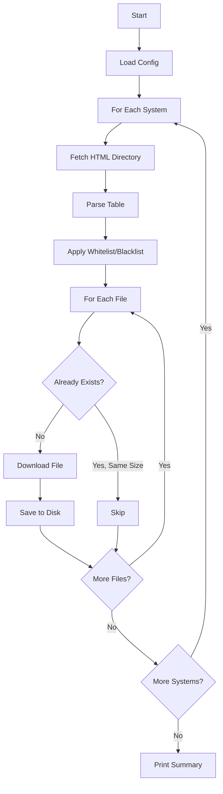
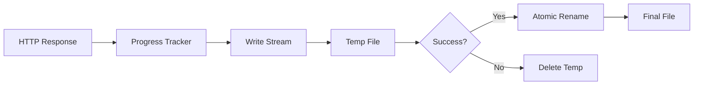
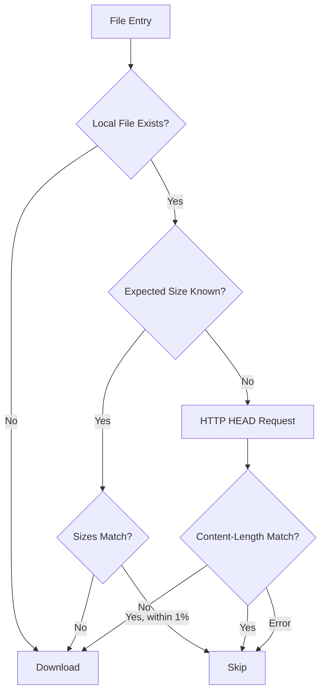

# Downloader

Downloads ZIP files from HTML table directory listings with streaming, atomic writes, and retry logic.

## Quick Start

The downloader is the default command. It processes all systems defined in your `app.config.json`, parsing HTML directory listings and downloading matching files:

```json
{
  "downloadDir": "./downloads/roms",
  "systems": [
    {
      "system": "snes",
      "url": "https://example.com/roms/snes",
      "folder": "SNES"
    }
  ]
}
```

Run:
```bash
# Preview what would be downloaded
pnpm start -- --dry-run

# Download files
pnpm start
```

The folder name defaults to the system shortcode. Override it with an explicit `folder` field if needed.

## CLI Options

```bash
# Preview what would be downloaded
pnpm start -- --dry-run          # or -n

# Limit to first N files
pnpm start -- --limit 10         # or -l 10

# Use custom config file
pnpm start -- --config ./my-config.json  # or -c ./my-config.json
```

| Option | Short | Description |
|--------|-------|-------------|
| `--dry-run` | `-n` | Preview mode - show what would happen without downloading |
| `--limit <N>` | `-l` | Limit to first N files |
| `--config <path>` | `-c` | Use custom config file path |

## Configuration

### System Configuration

Each system in the `systems` array requires:

| Option | Type | Required | Description |
|--------|------|----------|-------------|
| `system` | `string` | Yes | System shortcode (e.g., `gbc`, `snes`, `psx`) |
| `url` | `string` | Yes | Archive directory URL to process |
| `folder` | `string` | No | Folder name within `downloadDir` (defaults to system shortcode) |
| `tableId` | `string` | No | Override default table ID |
| `whitelist` | `string[]` | No | Override default whitelist |
| `blacklist` | `string[]` | No | Override default blacklist |

### Global Settings

Settings that affect all downloads:

| Option | Type | Default | Description |
|--------|------|---------|-------------|
| `downloadDir` | `string` | required | Parent directory for all system folders |
| `concurrency` | `number` | `1` | Number of concurrent downloads (1-10) |
| `userAgent` | `string` | `"Wget/1.21.2"` | User-Agent header for HTTP requests |
| `requestTimeoutMs` | `number` | `30000` | Request timeout in milliseconds (1000-300000) |
| `retries` | `number` | `2` | Number of retry attempts for failed requests (0-10) |
| `logLevel` | `string` | `"info"` | Log level: `"debug"`, `"info"`, or `"silent"` |

### Default Settings

Settings in `defaults` are inherited by all systems unless overridden:

| Option | Type | Default | Description |
|--------|------|---------|-------------|
| `tableId` | `string` | `"list"` | HTML table ID containing the file list |
| `whitelist` | `string[]` | `[]` | Only download files matching these terms |
| `blacklist` | `string[]` | `[]` | Exclude files matching these terms |

## How It Works

### Download Flow

The downloader parses HTML directory listings, applies filters, and downloads matching files with progress tracking.



### Streaming Downloads

Files are downloaded using Node.js streams to minimize memory usage. Large files never load entirely into memory.



### Atomic Writes

Downloads use a temp-then-rename pattern to prevent partial files:

1. Download to `.tmp-{filename}` in the same directory
2. On success, atomically rename to final filename
3. On failure, delete the temp file

This ensures you never have incomplete files in your download directory.

### Skip Detection

The downloader checks if files already exist before downloading:



**Size tolerance:** HTML displays rounded sizes (e.g., "155.7 KiB"), so the downloader allows 1% tolerance when comparing file sizes.

### Retry Logic

Failed downloads are retried with the configured retry count. The HTTP layer handles:

- Transient network errors
- Server timeouts
- Rate limiting (with backoff)

### Concurrent Downloads

Set `concurrency` to download multiple files in parallel:

```json
{
  "concurrency": 3
}
```

When `concurrency > 1`:
- Worker pool processes files in parallel
- Progress callbacks are disabled (no per-file progress bars)
- File completion callbacks still fire for overall progress

When `concurrency = 1` (default):
- Sequential downloads with real-time progress bars
- Better for rate-limited servers

## Output

Files are saved to the configured `downloadDir` with system subfolders:

```
downloads/roms/
├── snes/
│   ├── Super Mario Kart (USA).zip
│   └── Zelda (USA).zip
└── gbc/
    ├── Pokemon Blue (USA).zip
    └── Pokemon Red (USA).zip
```

### Download Status

Each file results in one of three statuses:

| Status | Description |
|--------|-------------|
| `downloaded` | File was successfully downloaded |
| `skipped` | File already exists with matching size |
| `failed` | Download failed (error message provided) |

## Types

### DownloadOptions

Configuration passed to download functions:

```typescript
type DownloadOptions = {
  userAgent: string;      // User-Agent header
  timeoutMs: number;      // Request timeout
  retries: number;        // Retry attempts
  downloadDir: string;    // Destination directory
};
```

### DownloadResult

Result returned for each file:

```typescript
type DownloadResult = {
  filename: string;       // Name of the file
  url: string;            // Source URL
  status: DownloadStatus; // 'downloaded' | 'skipped' | 'failed'
  bytesDownloaded: number; // Bytes transferred (0 if skipped/failed)
  error?: string;         // Error message if failed
};
```

### DownloadProgress

Progress callback data (sequential mode only):

```typescript
type DownloadProgress = {
  filename: string;           // Current file
  bytesDownloaded: number;    // Bytes transferred so far
  totalBytes: number | null;  // Total size (null if unknown)
  percentage: number | null;  // 0-100 (null if size unknown)
};
```

## Directory Structure

```
src/downloader/
├── downloader.ts    # Main implementation
│                    # - downloadFile(): Single file download
│                    # - downloadSequential(): One at a time
│                    # - downloadConcurrent(): Parallel downloads
├── types.ts         # Type definitions
│                    # - DownloadOptions, DownloadResult
│                    # - DownloadProgress, ProgressCallback
└── index.ts         # Module exports
```

## Security

The downloader includes several security measures:

- **Path traversal prevention**: Filenames are sanitized to prevent writing outside the download directory
- **URL validation**: Only HTTP/HTTPS URLs are accepted
- **Safe filenames**: Dangerous characters are removed or replaced
- **Atomic writes**: Downloads use temp files to prevent partial files

## Dependencies

Internal modules used:

| Module | Purpose |
|--------|---------|
| `../http` | HTTP fetching with retry logic |
| `../utils` | Path sanitization, atomic file operations |

No external dependencies beyond Node.js built-ins (`node:fs`, `node:stream`, `node:path`).
