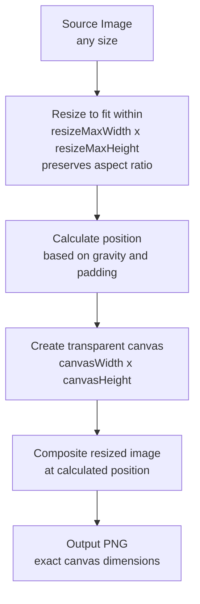

# Format Module

The format module provides artwork image formatting for device-specific layouts. It resizes images and composites them onto transparent canvases with configurable alignment and padding.

## Architecture

```
src/format/
├── types.ts      # Type definitions (FormatSettings, FormatResult, etc.)
├── scanner.ts    # Scans Imgs directories for source images
├── processor.ts  # Image processing with sharp (resize, composite)
├── format.ts     # Main orchestrator, processes all systems
└── index.ts      # Barrel exports
```

## Module Overview

### types.ts

Defines the core types:

- `Gravity` - Alignment options: `'east' | 'west' | 'center' | 'north' | 'south'`
- `FormatSettings` - Configuration for formatting (canvas size, resize limits, gravity, padding, output folder)
- `ImageFile` - Discovered image file metadata
- `FormatResult` - Result of processing a single image (formatted, skipped, or failed)
- `FormatSummary` - Aggregate statistics for a format operation
- `FormatOptions` - Runtime options (dryRun, force, settings, limit)

### scanner.ts

Handles filesystem operations:

- `scanForImages(imgsDir)` - Scans an Imgs directory for PNG/JPG files (direct children only)
- `findExistingFormatted(imageStem, outputDir)` - Checks if a formatted image already exists
- `ensureOutputDir(outputDir)` - Creates the output directory if needed
- `getOutputDirectory(imgsDir, outputFolder)` - Constructs the output path
- `getImgsDirectory(romDirectory)` - Constructs the Imgs path from a ROM directory

### processor.ts

Core image processing using [sharp](https://sharp.pixelplumbing.com/):

- `processImage(image, settings, outputDir, force)` - Processes a single image:
  1. Resizes to fit within max dimensions (preserves aspect ratio)
  2. Calculates position based on gravity and padding
  3. Creates transparent canvas at target size
  4. Composites resized image at calculated position
  5. Saves as PNG for transparency support

- `calculatePosition(canvasWidth, canvasHeight, imageWidth, imageHeight, gravity, padding)` - Calculates composite position based on gravity:
  - `west`: Left edge + padding, vertically centered
  - `east`: Right edge - padding, vertically centered
  - `north`: Top edge + padding, horizontally centered
  - `south`: Bottom edge - padding, horizontally centered
  - `center`: Centered both ways (padding ignored)

### format.ts

Main entry point and orchestrator:

- `runFormat(config, options)` - Processes all enabled systems:
  1. Iterates through configured systems
  2. Skips disabled systems
  3. Scans each system's Imgs directory
  4. Processes images (or previews in dry-run mode)
  5. Renders progress and summary

## Configuration

Settings are defined in `app.config.json` under the `format` key:

```json
{
  "format": {
    "canvasWidth": 640,
    "canvasHeight": 480,
    "resizeMaxWidth": 320,
    "resizeMaxHeight": 320,
    "gravity": "west",
    "padding": 20,
    "outputFolder": "RG35XX"
  }
}
```

| Setting | Type | Default | Description |
|---------|------|---------|-------------|
| canvasWidth | number | 640 | Output canvas width in pixels |
| canvasHeight | number | 480 | Output canvas height in pixels |
| resizeMaxWidth | number | 320 | Max artwork width before compositing |
| resizeMaxHeight | number | 320 | Max artwork height before compositing |
| gravity | string | "east" | Alignment: east, west, center, north, south |
| padding | number | 0 | Padding from edge in pixels |
| outputFolder | string | "Formatted" | Subfolder name in Imgs/ for output |

## Processing Flow



## Usage

```bash
# Format with config settings
pnpm cli format

# Preview without processing
pnpm cli format --dry-run

# Overwrite existing formatted images
pnpm cli format --force

# Limit to first N images per system
pnpm cli format --limit 5
```

## Output Structure

```
downloads/roms/
└── snes/
    ├── Imgs/                    # Source images
    │   ├── Game1.png
    │   └── Game2.png
    └── Imgs/Formatted/          # Formatted output (or custom outputFolder)
        ├── Game1.png
        └── Game2.png
```

## Use Case: Retro Handhelds

This module was designed for formatting cover art for retro gaming handhelds like the Anbernic RG35XX with Garlic OS. These devices display box art alongside game lists and require specific image dimensions and alignment.

Example settings for RG35XX (640x480 screen, art on left side):

```json
{
  "format": {
    "canvasWidth": 640,
    "canvasHeight": 480,
    "resizeMaxWidth": 320,
    "resizeMaxHeight": 320,
    "gravity": "west",
    "padding": 20,
    "outputFolder": "RG35XX"
  }
}
```
