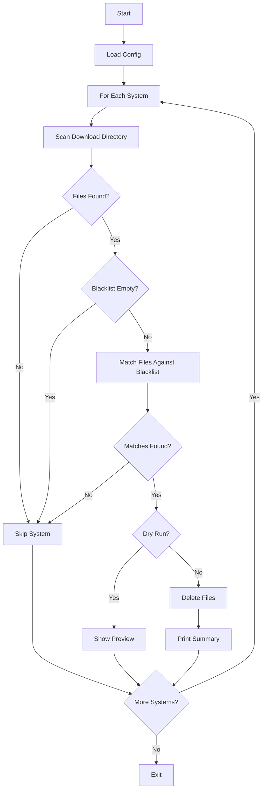
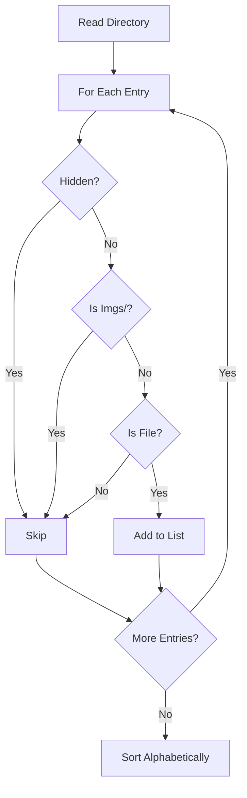

# Purge Module

Removes files from your download directories that match configured blacklist patterns. Useful for cleaning up unwanted files after an initial download.

## Table of Contents

- [Quick Start](#quick-start)
- [How It Works](#how-it-works)
- [Configuration](#configuration)
  - [Filter Syntax](#filter-syntax)
- [CLI Options](#cli-options)
- [Output](#output)
- [Architecture](#architecture)
- [Types](#types)
- [Exit Codes](#exit-codes)

## Quick Start

The purge command processes all systems defined in your `app.config.json`, removing files that match the blacklist patterns:

```bash
# Preview what would be removed (no deletions)
pnpm cli purge --dry-run

# Remove files matching blacklist patterns
pnpm cli purge

# Limit to first N deletions
pnpm cli purge --limit 10
```

## How It Works

1. **Scans** each system's download directory for all files (excludes `Imgs/` subdirectory and hidden files)
2. **Matches** each filename against the configured blacklist patterns (case-insensitive)
3. **Deletes** matching files (or shows preview in dry-run mode)

## Configuration

The purge command uses the `blacklist` array from your config. Blacklist can be defined globally in `defaults` or per-system:

```json
{
  "downloadDir": "./downloads/roms",
  "defaults": {
    "blacklist": [
      "(Japan)",
      "(Europe)",
      "(Beta)",
      "(Proto)",
      "(Virtual Console)"
    ]
  },
  "systems": [
    {
      "system": "snes",
      "url": "https://example.com/roms/snes"
    },
    {
      "system": "gbc",
      "url": "https://example.com/roms/gbc",
      "blacklist": ["(Japan)"]
    }
  ]
}
```

Per-system blacklist overrides the defaults entirely.

### Filter Syntax

The blacklist supports AND/OR expression syntax. All matching is **case-insensitive**.

**OR matching** - multiple terms match if any is found:
```json
{
  "blacklist": ["(Japan)", "(Europe)"]
}
```
Matches: `Game (Japan).zip`, `Game (Europe).zip`

**AND matching** - use `AND` to require all words:
```json
{
  "blacklist": ["Rev AND Japan"]
}
```
Matches: `Game (Japan) (Rev 1).zip` but NOT `Game (Japan).zip`

**Combined** - mix AND expressions with OR logic:
```json
{
  "blacklist": ["(Japan)", "Beta AND Proto"]
}
```
Matches: `Game (Japan).zip` OR files containing both "Beta" AND "Proto"

## CLI Options

```bash
pnpm cli purge --dry-run          # or -n
pnpm cli purge --limit 10         # or -l 10
pnpm cli purge --config ./my.json # or -c ./my.json
```

| Option | Short | Description |
|--------|-------|-------------|
| `--dry-run` | `-n` | Preview mode - show what would be deleted |
| `--limit <N>` | `-l` | Limit to first N deletions |
| `--config <path>` | `-c` | Use custom config file path |

## Output

### Header and Progress

```
╔════════════════════════════════════════════════════════╗
║  Purge Blacklisted Files                               ║
╚════════════════════════════════════════════════════════╝

  Directory: /path/to/downloads/roms/snes
Files found: 150
Blacklist patterns: 5
Matched: 23 files

[ 1/23] x Game Title (Japan).zip
[ 2/23] x Another Game (Europe).zip
...
```

### Summary

```
╔════════════════════════════════════════════════════════╗
║  Purge Summary                                         ║
╚════════════════════════════════════════════════════════╝

  Scanned:         150
  Matched:         23
  Deleted:         23
  Failed:          0
```

### Dry Run Mode

In dry-run mode, files are marked as "skipped" and the header shows a warning:

```
  [DRY RUN] No files will be deleted

Files that would be deleted:
  x Game Title (Japan).zip
  x Another Game (Europe).zip
```

## Architecture

### Purge Flow



### Directory Scanning

The scanner excludes certain files and directories:



### Module Structure

```
src/purge/
├── index.ts      # Barrel exports
├── purge.ts      # Main purge logic and orchestration
├── scanner.ts    # Directory scanning (excludes Imgs/, hidden files)
├── types.ts      # Type definitions
└── README.md     # This file
```

## Types

```typescript
type PurgeFileEntry = {
  /** Absolute path to the file */
  path: string;
  /** Filename (for display and filter matching) */
  filename: string;
};

type PurgeResult = {
  file: PurgeFileEntry;
  status: 'deleted' | 'skipped' | 'failed';
  error?: string;
};

type PurgeSummary = {
  totalScanned: number;
  matchedBlacklist: number;
  deleted: number;
  failed: number;
};
```

## Exit Codes

| Code | Meaning |
|------|---------|
| `0` | Success - all matched files deleted (or dry-run completed) |
| `1` | Failure - at least one deletion failed, or fatal error |

## See Also

- [Downloader README](../downloader/README.md) - Blacklist configuration during downloads
- [Main README](../../README.md) - Full configuration reference
