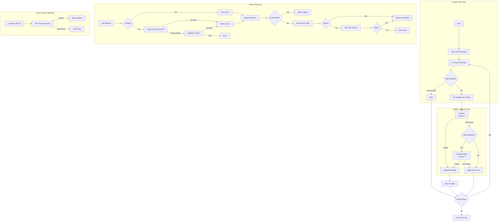

# Scraper

Downloads cover art for your files using multiple sources with fallback support.

## Quick Start

Add to your `app.config.json`:

```json
{
  "scraper": {
    "enabled": true,
    "systemId": 10
  }
}
```

Run:
```bash
pnpm start -- scrape
```

## Sources

The scraper uses an adapter pattern with multiple sources. Sources are tried in priority order until artwork is found.

### Libretro Thumbnails (Default)

- **No authentication required**
- Uses filename-based matching against No-Intro naming conventions
- Fast direct downloads from CDN
- Covers 130+ systems

Libretro is enabled by default with priority 1. No configuration needed.

### ScreenScraper

- **Requires API credentials**
- Uses CRC32 hash-based matching for maximum accuracy
- Rate limited (respect API limits)
- Best for obscure titles that Libretro doesn't have

ScreenScraper is disabled by default. Enable it for fallback when Libretro doesn't find a match.

## Best-Effort Matching

When an exact filename match fails, the Libretro adapter uses a **manifest-based approach** for fast, intelligent matching.

### How It Works

1. **Manifest fetch** - Fetches file listing from GitHub API once per system (cached)
2. **Exact match** - Direct lookup in manifest
3. **Variant-stripped match** - Strips `(Proto)`, `(Beta)`, etc. but keeps region tags
4. **Title-only match** - Extracts base title and finds best match by region priority

This approach is **much faster** than per-file HTTP requests because all matching happens locally against the cached manifest.

### Matching Priority

| Priority | Match Type | Example |
|----------|-----------|---------|
| 1 | Exact match | `Game (USA)` → `Game (USA)` |
| 2 | Variant-stripped (keep region) | `Game (USA) (Proto)` → `Game (USA)` |
| 3 | Title-only (best region match) | `Game (USA)` → `Game (World)` |

### Variant Patterns Stripped

| Category | Examples |
|----------|----------|
| Development | `(Proto)`, `(Proto 1)`, `(Beta)`, `(Demo)`, `(Sample)` |
| Platform variants | `(e-Reader)`, `(Virtual Console)`, `(Switch Online)`, `(Wii)` |
| Revisions | `(Rev 1)`, `(Rev A)`, `(v1.1)` |
| Unlicensed | `(Unl)`, `(Pirate)` |
| Publishers | `(Retro-Bit)`, `(Piko Interactive)`, `(Hudson)` |
| Special | `(Kiosk)`, `(Program)`, date suffixes like `(1992-10-06)` |
| BIOS | `[BIOS]` prefix |

### Region Priority

When multiple candidates match by title, the best region is selected:

1. `(World)` - Preferred, covers all regions
2. `(USA)` - US release
3. `(Japan, USA)` - Joint release
4. `(USA, Europe)` - Western release
5. `(Europe)` - EU release
6. `(Japan)` - Japanese release

### Console Output

Best-effort matches are displayed in **amber/orange** to distinguish them from exact matches:

```
[1/100] ✓ Game (USA).zip → Game (USA)                         # Exact (green)
[2/100] ~ Game (USA) (Proto).zip → Game (USA) (best effort)   # Best-effort (amber)
[3/100] ? Unknown Game.zip (not in database)                  # Not found (blue)
```

### Summary Breakdown

The scrape summary shows a breakdown of exact vs best-effort matches:

```
──────────────────────────────────────────────────
Scrape Summary
──────────────────────────────────────────────────
  Total ROMs:      100
  Downloaded:      85
    Exact:         75
    Best effort:   10
  Skipped:         10
  Not found:       5
  Failed:          0
──────────────────────────────────────────────────

10 images used best-effort matching (filename variants).
```

### Examples

| ROM Filename | Best-Effort Match | Match Type |
|-------------|-------------------|------------|
| `Aladdin (USA) (Proto).zip` | `Aladdin (USA)` | Variant-stripped |
| `Donkey Kong (USA) (e-Reader).zip` | `Donkey Kong (World)` | Title-only |
| `Ice Climber (USA).zip` | `Ice Climber (World)` | Title-only |
| `Caveman Ninja (USA) (Beta).zip` | `Caveman Ninja (USA)` | Variant-stripped |
| `[BIOS] Demo Vision (USA).zip` | `Demo Vision (USA)` | Variant-stripped |

## Configuration

### Common Options

These apply to all adapters:

```json
{
  "scraper": {
    "enabled": true,
    "systemId": 10,
    "mediaType": "box-2D",
    "regionPriority": ["us", "wor", "eu", "jp"],
    "skipExisting": true,
    "resize": {
      "enabled": false,
      "maxWidth": 300,
      "maxHeight": 300
    }
  }
}
```

| Option | Type | Default | Description |
|--------|------|---------|-------------|
| `enabled` | `boolean` | `false` | Enable artwork downloading |
| `systemId` | `number` | (required) | System ID for platform identification |
| `mediaType` | `string` | `"box-2D"` | Media type to download |
| `regionPriority` | `string[]` | `["us","wor","eu","jp"]` | Region preference order |
| `skipExisting` | `boolean` | `true` | Skip files that already have images |
| `resize` | `object` | - | Image resize options |

### Libretro Configuration

```json
{
  "scraper": {
    "libretro": {
      "enabled": true,
      "priority": 1
    }
  }
}
```

| Option | Type | Default | Description |
|--------|------|---------|-------------|
| `enabled` | `boolean` | `true` | Enable Libretro adapter |
| `priority` | `number` | `1` | Priority (lower = tried first) |

### ScreenScraper Configuration

```json
{
  "scraper": {
    "screenscraper": {
      "enabled": true,
      "priority": 2,
      "credentials": {
        "devId": "YOUR_DEV_ID",
        "devPassword": "YOUR_DEV_PASSWORD",
        "userId": "YOUR_USERNAME",
        "userPassword": "YOUR_PASSWORD"
      },
      "rateLimitMs": 1000
    }
  }
}
```

| Option | Type | Default | Description |
|--------|------|---------|-------------|
| `enabled` | `boolean` | `false` | Enable ScreenScraper adapter |
| `priority` | `number` | `2` | Priority (lower = tried first) |
| `credentials` | `object` | - | API credentials (required if enabled) |
| `rateLimitMs` | `number` | `1000` | Delay between API requests (ms) |

#### Getting ScreenScraper Credentials

1. Register a free account at [screenscraper.fr](https://www.screenscraper.fr/)
2. Request developer credentials via the ScreenScraper forums
3. Add credentials to your config file

### Resize Options

```json
{
  "scraper": {
    "resize": {
      "enabled": true,
      "maxWidth": 300,
      "maxHeight": 300
    }
  }
}
```

| Option | Type | Default | Description |
|--------|------|---------|-------------|
| `enabled` | `boolean` | `false` | Enable image resizing |
| `maxWidth` | `number` | `300` | Maximum width in pixels (100-1000) |
| `maxHeight` | `number` | `300` | Maximum height in pixels (100-1000) |

## System IDs

| System | ID | System | ID |
|--------|-----|--------|-----|
| Sega Mega Drive / Genesis | 1 | Sega Master System | 2 |
| NES | 3 | SNES | 4 |
| Sega Game Gear | 5 | Nintendo Game Boy | 9 |
| Nintendo Game Boy Color | 10 | Nintendo Virtual Boy | 11 |
| Nintendo Game Boy Advance | 12 | Nintendo 64 | 14 |
| Sega 32X | 19 | Sega Mega-CD | 20 |
| Sega Saturn | 22 | Sega Dreamcast | 23 |
| Atari 2600 | 26 | Atari 7800 | 27 |
| NEC PC Engine / TurboGrafx-16 | 31 | Atari Lynx | 43 |
| Bandai WonderSwan | 45 | Bandai WonderSwan Color | 46 |
| ColecoVision | 48 | Sony PlayStation | 57 |
| Sony PSP | 58 | Commodore 64 | 66 |
| MAME | 75 | SNK Neo Geo Pocket Color | 82 |
| Nintendo DS | 106 | NEC PC Engine CD | 114 |
| Mattel Intellivision | 115 | SNK Neo Geo | 142 |

See `screenscraper/systems.ts` for the complete list with ROM extensions.

## Media Types

| Type | Description |
|------|-------------|
| `box-2D` | 2D box art (front cover) - **default** |
| `box-3D` | 3D box art render |
| `ss` | In-game screenshot |
| `sstitle` | Title screen |
| `wheel` | Logo/wheel art |
| `mixrbv1` | Mix image v1 (composite) |
| `mixrbv2` | Mix image v2 (composite) |
| `marquee` | Arcade marquee |
| `fanart` | Fan artwork |

## CLI Options

```bash
# Preview what would be downloaded
pnpm start -- scrape --dry-run

# Force re-download (overwrite existing)
pnpm start -- scrape --force

# Limit to first N files
pnpm start -- scrape --limit 10

# Override media type
pnpm start -- scrape --media ss

# Override region priority
pnpm start -- scrape --region us,eu,jp

# Use specific source only
pnpm start -- scrape --source libretro
pnpm start -- scrape --source screenscraper
```

## Output

Images are saved to an `Imgs/` subdirectory:

```
downloads/roms/snes/
├── Super Mario Kart (USA).zip
├── Zelda (USA).zip
└── Imgs/
    ├── Super Mario Kart (USA).png
    └── Zelda (USA).png
```

This follows the convention used by Anbernic devices, EmulationStation, and other frontends.

## Architecture

### Flow Diagram



### Directory Structure

```
src/scraper/
├── adapters/           # Adapter interface & registry
│   ├── types.ts        # ArtworkAdapter interface
│   ├── registry.ts     # Adapter registration & fallback logic
│   └── index.ts
├── libretro/           # Libretro Thumbnails adapter
│   ├── adapter.ts      # Implementation
│   ├── manifest.ts     # Manifest fetching and matching
│   ├── systems.ts      # System ID to folder name mapping
│   └── sanitizer.ts    # Filename sanitization
├── screenscraper/      # ScreenScraper adapter
│   ├── adapter.ts      # Implementation
│   ├── client.ts       # API client
│   ├── systems.ts      # System definitions
│   └── types.ts        # API types
├── scraper.ts          # Main orchestrator
├── scanner.ts          # Directory scanning
├── hasher.ts           # CRC32 calculation
├── downloader.ts       # Image downloading
└── reporter.ts         # Console output
```

## Adding New Adapters

1. Create a new directory: `src/scraper/newadapter/`
2. Implement the `ArtworkAdapter` interface from `adapters/types.ts`
3. Create a factory function
4. Register in `scraper.ts`
5. Add config schema in `src/config/schema.ts`

See [docs/ARTWORK_ADAPTER_PATTERN.md](../../docs/ARTWORK_ADAPTER_PATTERN.md) for the full design document.
